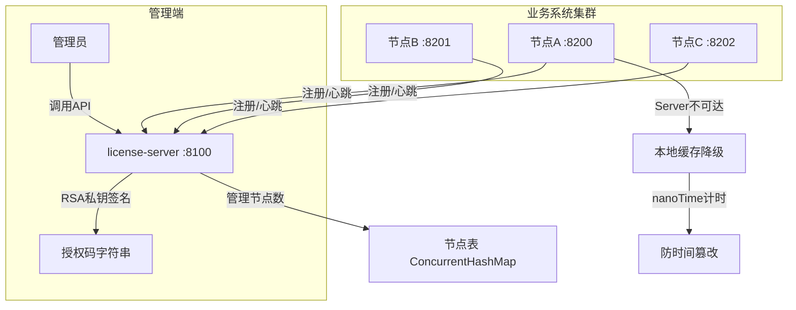

# Spring Boot License 中心授权服务

基于 **授权码 + 中心授权服务** 的 License 授权方案，支持集群节点管理、缓存降级、防时间篡改。

## 架构设计




## 模块列表

| 模块 | 用途 | 核心文件 |
|---|---|---|
| license-common | 公共模型 + 工具 | `LicenseCodec`, `CryptoUtils`, `ServerInfoUtils` |
| license-server | 中心授权服务 | `NodeManagerService`, `LicenseCodeService` |
| license-client | 客户端 SDK | `LicenseClientService`, `AntiTamperChecker`, `LocalCacheManager` |
| license-demo | 示例业务系统 | `BusinessController` |

## 核心特性

### 1. 授权码模式
- 管理员通过 API 签发 **Base64 授权码字符串**（RSA 签名）
- 客户端只需在 `application.yml` 中配置 `license.code` 即可

### 2. 中心节点管理
- 节点启动自动注册，获取 nodeId
- 定时心跳（默认 120s），超时自动释放（默认 5min）
- `maxMachineCount` 精确控制在线节点数

### 3. 缓存降级 + 防时间篡改
- Server 不可达时，本地 AES-GCM 加密缓存保证降级运行（默认宽限期 72 小时）
- `System.nanoTime()` 单调计时，不受系统时钟修改影响
- 时钟回拨检测：`currentTime < lastVerifyTime` → 拒绝

### 4. Spring Boot 自动配置
- 引入 `license-client` 依赖即自动生效，**不可通过配置关闭**

## 快速开始

### 第一步：生成密钥对

```bash
cd doc
chmod +x generate-keys.sh
./generate-keys.sh
```

### 第二步：启动 License Server

```bash
cp -r doc/keys license-server/
cd license-server
mvn spring-boot:run
```

### 第三步：签发授权码

```bash
curl -X POST http://localhost:8100/api/license/generate \
  -H "Content-Type: application/json" \
  -d '{
    "subject": "MyApp",
    "expiryTime": 1803571200000,
    "maxMachineCount": 5,
    "modules": ["base", "report"],
    "description": "示例授权"
  }'
```

### 第四步：启动业务系统

```bash
cp -r doc/keys license-demo/
cd license-demo

export LICENSE_CODE="<上一步获得的授权码>"
mvn spring-boot:run
```

### 第五步：验证

```bash
# 业务接口（需要 License 校验）
curl http://localhost:8200/api/hello

# 查看 License 状态
curl http://localhost:8200/api/license/status

# 查看机器信息
curl http://localhost:8200/api/machine/info
```

## API 汇总

### License Server (:8100)

| 方法 | 路径 | 说明 |
|---|---|---|
| POST | `/api/license/generate` | 签发授权码 |
| GET | `/api/license/list` | 查看所有授权码 |
| DELETE | `/api/license/{id}` | 删除授权码 |
| GET | `/api/license/publicKey` | 获取公钥 |
| GET | `/api/license/nodes` | 查看在线节点 |
| POST | `/api/node/register` | 节点注册 |
| POST | `/api/node/heartbeat` | 节点心跳 |
| POST | `/api/node/unregister` | 节点注销 |
| GET | `/api/node/stats` | 节点请求统计 |

### 业务系统 (:8200)

| 方法 | 路径 | 说明 |
|---|---|---|
| GET | `/api/hello` | 示例业务接口 |
| GET | `/api/license/status` | License 状态 |
| GET | `/api/machine/info` | 机器信息 |

## 客户端配置参考

```yaml
license:
  code: ${LICENSE_CODE:}                          # 授权码
  server-url: ${LICENSE_SERVER_URL:http://localhost:8100}  # License Server 地址
  public-key-path: ./keys/public_key.pem          # RSA 公钥路径
  heartbeat-interval-seconds: 120                 # 心跳间隔
  grace-period-hours: 72                          # 离线宽限期
  cache-path: ./.license-cache                    # 本地缓存路径
  exclude-paths: /actuator/**,/error              # 排除校验的路径
```
